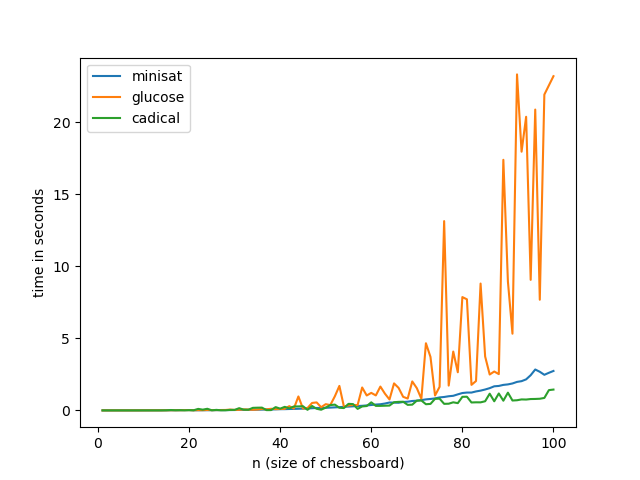

# N queens problem

We attempted to use the following solvers:
- minisat
- glucose
- cadical

without changing any of their parameters.

The `.cnf` files for the problem are generated using the `generate.py` script.

## Results

Results were obtained by running the `run.py` script which generates the inputs,
runs all the inputs on all of the solvers and produces a csv file and a plot.

We can see that `minisat` and `cadical` are unphased by the growing size of the chessboard.
In contrast, `glucose` seems to not only genuinely struggle on larger inputs,
but it's also quite unstable.

We appreciate the predictible performance of `minisat` and would probably choose it for subsequent explorations.
Again, in contrast, we do not plan to use `glucose` again because of the struggle.
